# 🚀 ORA (Outfit Rental Assistant)

### The Digital OS for Fashion Rental Businesses

> A **Vertical SaaS + Hyper-Local O2O Marketplace** transforming how unorganized rental boutiques manage operations and convert online discovery into real-world revenue.


---

## 🎨 User Experience (Marketplace)

The customer-facing web platform allows users to discover designer outfits and reserve them for a 24-hour trial period.

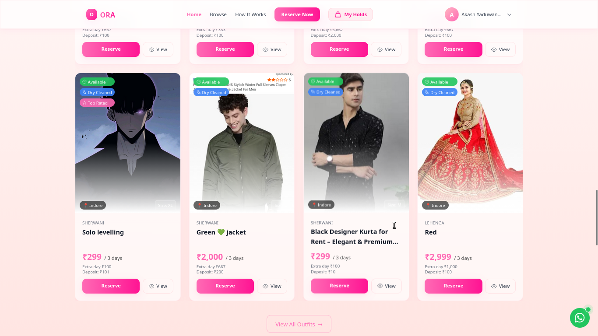

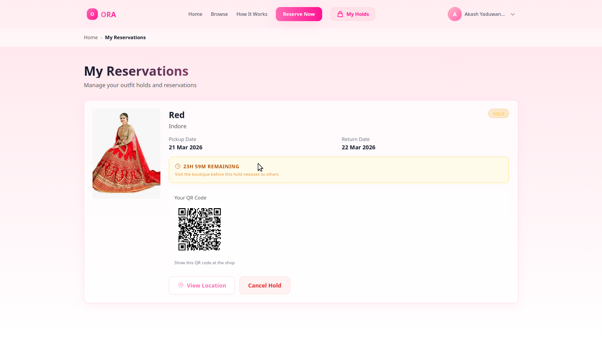
<!-- slide -->
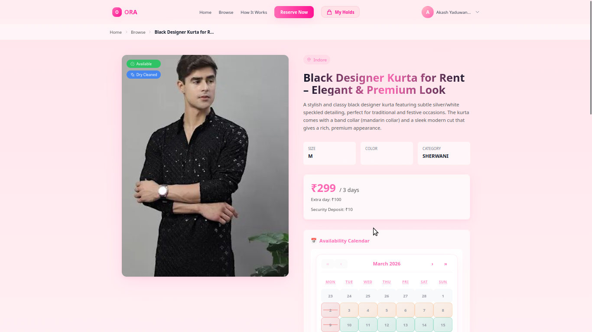
<!-- slide -->
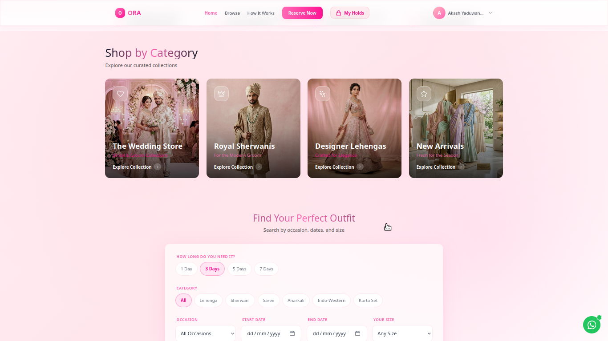
----

## 🛡️ Admin Control Tower

A central dashboard for platform administrators to monitor health, manage shop approvals, and track revenue.

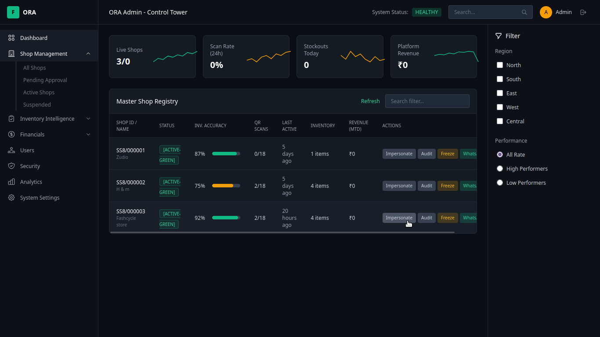
---

## 📱 Shop Owner OS (Mobile App)

The mobile engine that powers boutique operations—inventory tracking, QR scanning, and booking management.

<div align="center">
  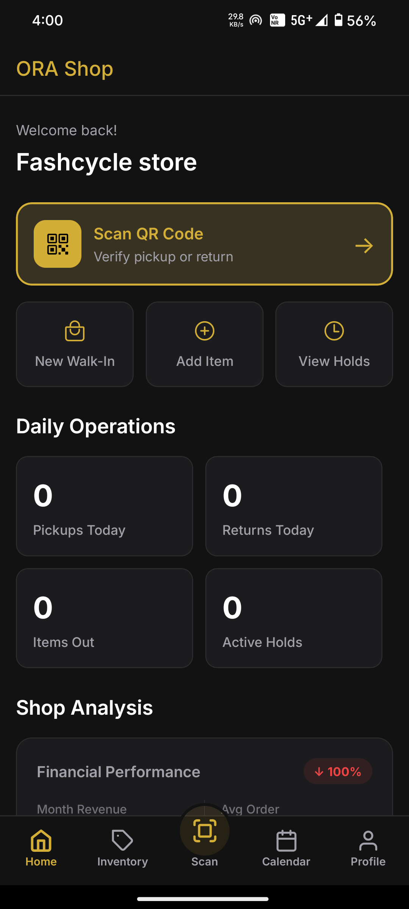
  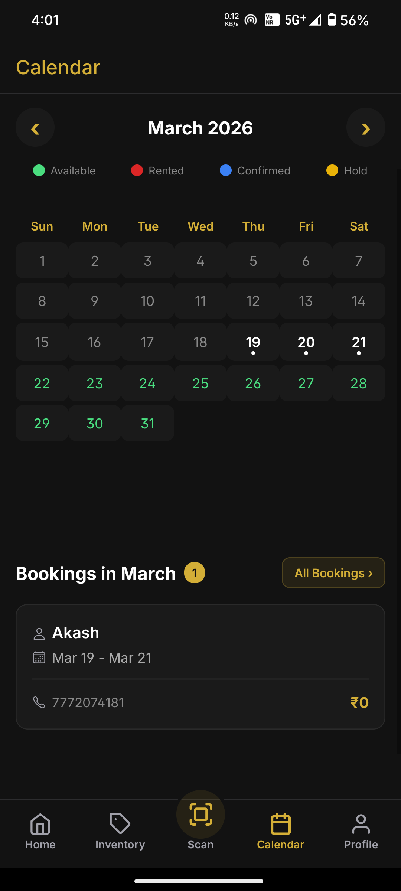
  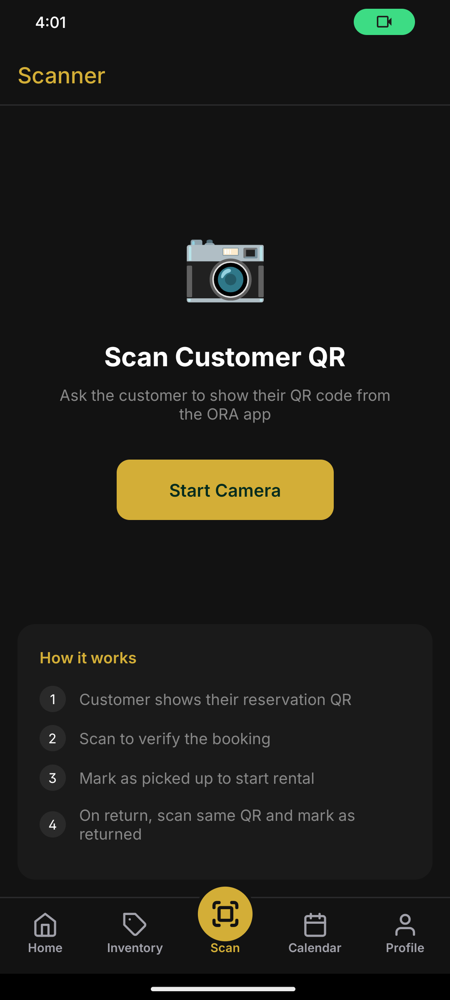
  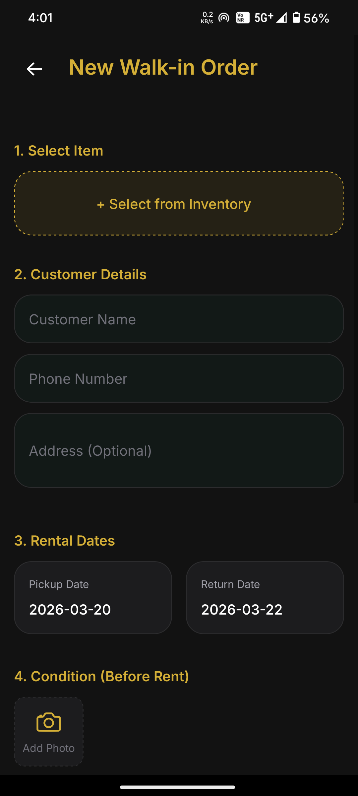
</div>
<div align="center" style="margin-top: 10px;">
  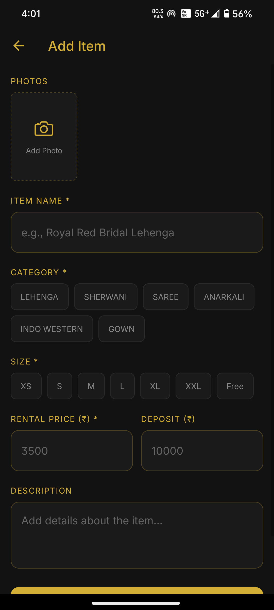
  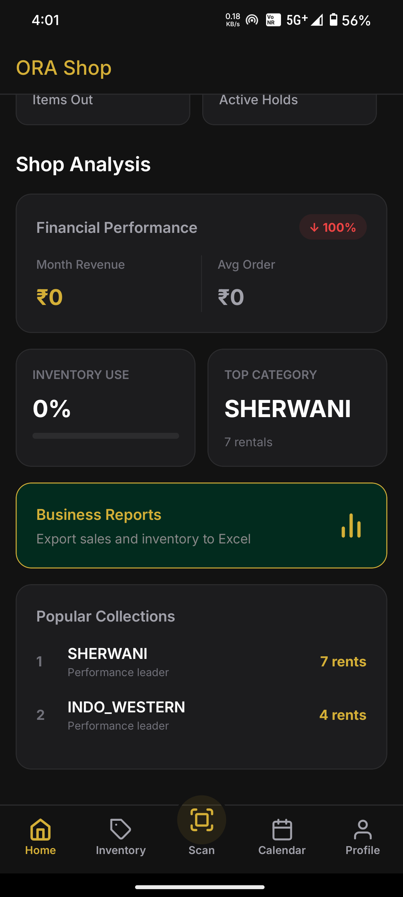
  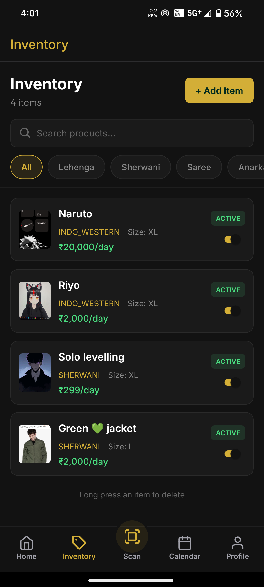
</div>

You can downlaod the app from here :https://github.com/unshakensoul17/Ora/releases/download/App/Ora.shop.apk
---

## 🧠 Vision

Local fashion rental shops operate like mini-enterprises—but without software. ORA acts as their **“Digital Munim”**, bringing:

*   **Structured Inventory**: Real-time tracking of rental stock.
*   **Intelligent Booking**: Prevention of double-bookings with automated cleaning buffers.
*   **Verified Attribution**: QR-based walk-in verification (The O2O Bridge).

---

## 🎯 What ORA Solves

### 🔴 Problem
*   **Chaos**: No inventory tracking → frequent double bookings.
*   **Blind Spots**: No attribution → unclear marketing ROI for shop owners.
*   **Leaking Revenue**: Offline-only workflows → lost digital demand.

### 🟢 Solution
ORA creates a **closed-loop system**:
```text
Discover Online → Reserve → Visit Store → Scan QR → Verified Lead → Revenue
```

---

## 🏗️ Product Architecture

ORA is a modular platform powered by a centralized NestJS core.

*   `backend/`: Core API (NestJS, Prisma, PostgreSQL)
*   `user-web/`: Customer Marketplace (Next.js 14)
*   `admin/`: Platform Control (Next.js 14, Dark Theme)
*   `shop-app/`: Mobile OS (React Native/Expo)

---

## 🔄 Core User Flow

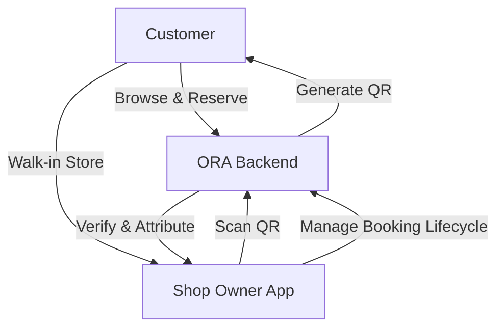

---

## ⚡ Key Innovations

### 📅 Smart Calendar Engine
*   **Redis-Powered Locking**: Prevents race conditions during simultaneous bookings.
*   **Automated Buffers**: Integrated D-1 (prep) and D+1 (cleaning) windows.

### 🏪 Shop Masking System
*   Protects marketplace integrity by revealing shop details **only after reservation**.

### 🔗 QR-Based Attribution
*   Unique QR for each hold → In-store scan = **Verified footfall**.
*   Enables the **Pay-per-Footfall** monetization model.

---

## 🛠️ Tech Stack

| Layer      | Technology              |
| ---------- | ----------------------- |
| **Backend**| NestJS + Prisma ORM     |
| **DB**     | PostgreSQL + Redis      |
| **Search** | Meilisearch             |
| **Mobile** | React Native (Expo)     |
| **Web**    | Next.js 14 + Tailwind   |
| **DevOps** | Render + Vercel + AWS   |

---

## 🚀 Getting Started

Quick start localized setup for developers:

1.  **Infrastructure**: `docker-compose up -d postgres redis meilisearch`
2.  **API**: `cd backend && npm install && npm run start:dev`
3.  **Marketplace**: `cd user-web && npm run dev`
4.  **Admin**: `cd admin && npm run dev`

---

## 💡 Final Thought

> ORA is not just software—it's **infrastructure for offline commerce in a digital-first world**.

---
