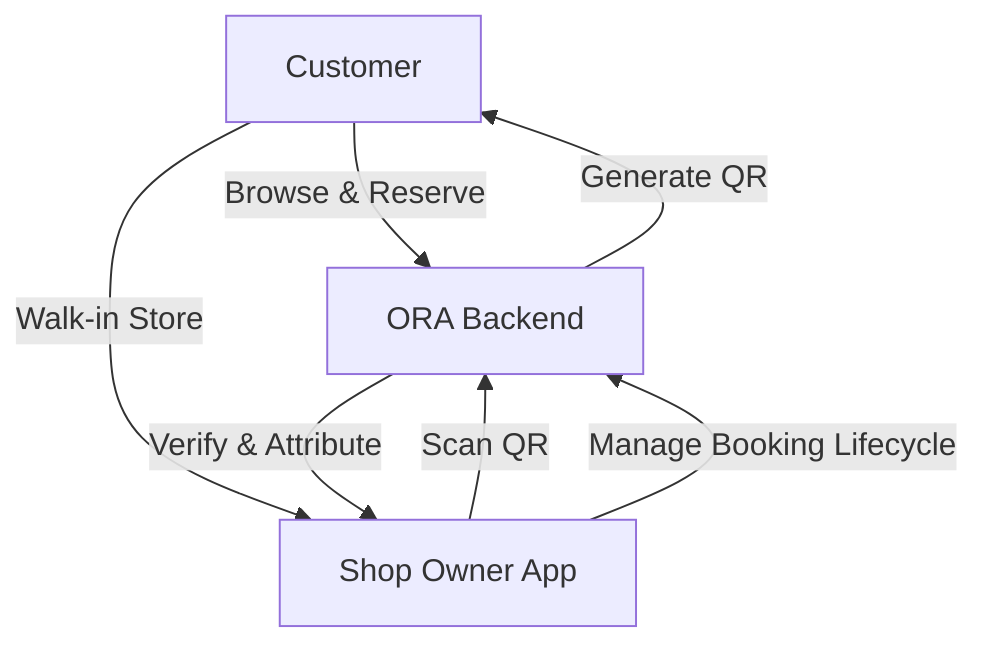

# 🚀 ORA (Outfit Rental Assistant)

### The Digital OS for Fashion Rental Businesses

> A **Vertical SaaS + Hyper-Local O2O Marketplace** transforming how unorganized rental boutiques manage operations and convert online discovery into real-world revenue.

---

## 🧠 Vision

Local fashion rental shops operate like mini-enterprises—but without software.

**ORA acts as their “Digital Munim”**, bringing:

* Structured inventory management
* Intelligent booking systems
* Verified customer acquisition

All while preserving the **offline trial experience**, which is critical in fashion.

---

## 🎯 What ORA Solves

### 🔴 Problem

* No inventory tracking → double bookings
* No attribution → unclear marketing ROI
* No digital presence → lost demand
* Offline-only workflows → inefficiency

### 🟢 Solution

ORA creates a **closed-loop system**:

```text
Discover Online → Reserve → Visit Store → Scan QR → Verified Lead → Revenue
```

---

## 🏗️ Product Architecture

ORA is built as a **modular, multi-client platform** powered by a shared backend.

```text
ora/
├── backend/          # Core API (NestJS)
├── shop-app/         # Mobile OS for shop owners
├── user-web/         # Customer marketplace
├── admin/            # Platform control dashboard
├── shared/           # Types & utilities
└── docs/             # Deployment + architecture docs
```

---

## 🔄 Core User Flow



---

## ⚡ Key Features

### 📅 Smart Calendar Engine

* Prevents **double-booking using Redis locks**
* Auto-applies **D-1 / D+1 buffers** for cleaning & prep
* Handles real-time availability at scale

---

### 🏪 Shop Masking System

* Prevents platform bypass
* Reveals shop details **only after reservation**
* Protects marketplace integrity

---

### 🔗 QR-Based Attribution (Core Innovation)

* Each reservation generates a **unique QR**
* In-store scan = **verified lead**
* Enables **pay-per-footfall monetization**

---

### 📦 Inventory OS (Shop App)

* Add/manage items via mobile
* Track availability visually
* Mark items inactive (cleaning, repair, etc.)

---

### 🔍 Lightning-Fast Search

* Powered by **Meilisearch**
* Typo-tolerant + relevance-ranked
* Designed for real-time product discovery

---

## 🛠️ Tech Stack

| Layer      | Technology              |
| ---------- | ----------------------- |
| Backend    | NestJS (Node.js)        |
| Database   | PostgreSQL + Prisma ORM |
| Caching    | Redis (locks + TTL)     |
| Search     | Meilisearch             |
| Mobile App | React Native (Expo)     |
| Web Apps   | Next.js 14              |
| Auth       | JWT + OTP               |
| Payments   | Razorpay                |

---

## 🧩 Core Data Models

| Entity              | Description                          |
| ------------------- | ------------------------------------ |
| `User`              | Customer accounts                    |
| `Shop`              | SaaS tenants (boutiques)             |
| `InventoryItem`     | Rental products                      |
| `AvailabilityBlock` | Time-based booking locks             |
| `Booking`           | Lifecycle (HOLD → RENTED → RETURNED) |
| `AttributionEvent`  | Verified walk-in ledger              |

---

## 💰 Business Model

| Tier         | Price      | Features                                |
| ------------ | ---------- | --------------------------------------- |
| Starter      | Free       | ≤50 items, basic features               |
| Pro          | ₹299/month | Unlimited inventory, premium visibility |
| Pay-per-lead | ₹50/scan   | Charged only on verified walk-ins       |

> 💡 **No fake leads. No wasted spend. Only real foot traffic is billed.**

---

## 🚀 Getting Started (Local Setup)

### Prerequisites

* Node.js 20+
* Docker & Docker Compose

---

### 1️⃣ Start Infrastructure

```bash
cd backend
docker-compose up -d postgres redis meilisearch
```

---

### 2️⃣ Backend Setup

```bash
cd backend
npm install
cp .env.example .env
npx prisma migrate dev
npm run seed
npm run start:dev
```

📍 API Docs: [http://localhost:3000/api/docs](http://localhost:3000/api/docs)

---

### 3️⃣ User Marketplace

```bash
cd user-web
npm install
cp .env.example .env.local
npm run dev
```

📍 [http://localhost:3001](http://localhost:3001)

---

### 4️⃣ Admin Dashboard

```bash
cd admin
npm install
cp .env.example .env.local
npm run dev
```

📍 [http://localhost:3002](http://localhost:3002)

---

### 5️⃣ Shop App (Mobile)

```bash
cd shop-app
npm install
npx expo start
```

---

## 🚀 Deployment

Full deployment guides available in `/docs`.

### Mobile (EAS)

```bash
eas build --platform android --profile production
eas build --platform ios --profile production
eas update --branch production --message "Update"
```

---

## 🧠 Why ORA is Different

| Traditional Platforms    | ORA                                 |
| ------------------------ | ----------------------------------- |
| Focus on online checkout | Focus on offline experience         |
| No attribution           | QR-based verified attribution       |
| Generic SaaS             | Vertical SaaS for rentals           |
| Inventory = quantity     | Inventory = time-based availability |

---

## 🔮 Future Roadmap

* 🤖 AI-based demand prediction
* 📊 Shop analytics dashboard
* 🌍 Hyperlocal expansion engine
* 🧠 Smart pricing optimization
* 🛍️ Multi-category rental support

---

## 📄 License

Private / Proprietary

---

## 💡 Final Thought

> ORA is not just software — it's **infrastructure for offline commerce in a digital-first world**.

---
